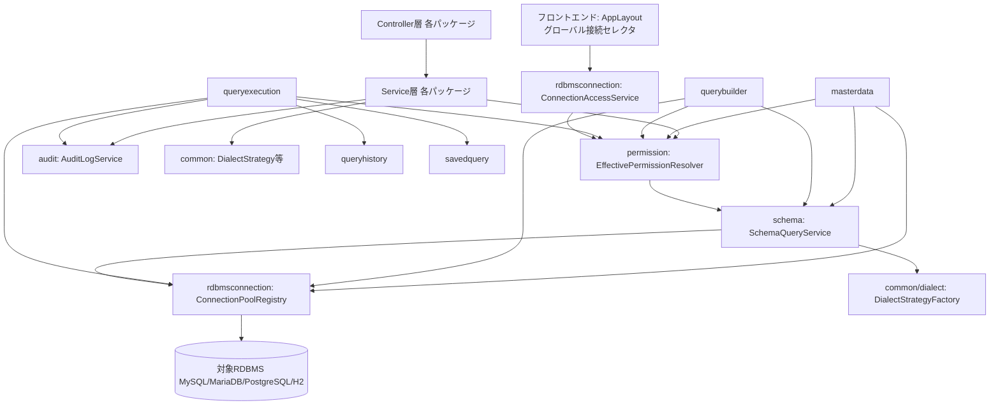
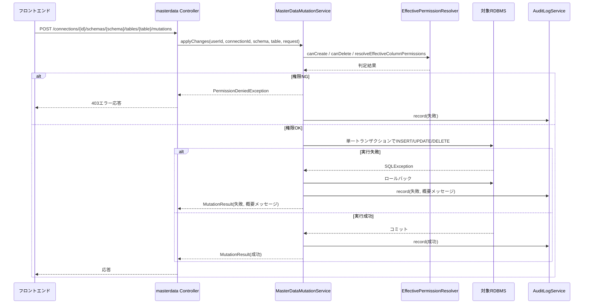

# component-dependency.md — 依存関係・通信パターン

## 依存関係マトリクス

`✓` は「行のパッケージが列のパッケージのサービスに依存する（呼び出す）」ことを表す。
すべての依存は各パッケージの Facade的サービス経由（`services.md` の「サービス間依存の原則」参照）。

| 依存元 \ 依存先 | common | audit | mail | userregistration | rdbmsconnection | schema | permission | queryhistory | savedquery |
|---|:---:|:---:|:---:|:---:|:---:|:---:|:---:|:---:|:---:|
| auth | ✓ | ✓ | | ✓ | | | | | |
| userregistration | ✓ | ✓ | ✓ | | | | | | |
| rdbmsconnection | ✓ | ✓ | | | | | ✓ *1 | | |
| schema | ✓ | ✓ | | | ✓ | | | | |
| permission | ✓ | ✓ | | ✓ | | ✓ | | | |
| masterdata | ✓ | ✓ | | | ✓ | ✓ | ✓ | | |
| querybuilder | ✓ | | | | ✓ | ✓ | ✓ | | |
| savedquery | ✓ | | | | | | | | |
| queryexecution | ✓ | ✓ | | | ✓ | | ✓ *2 | ✓ | ✓ |
| queryhistory | ✓ | | | | | | | | |
| audit | ✓ | | | | | | | | |
| mail | ✓ | | | | | | | | |
| config | ✓ | | | | | | | | |

*1, *2 は2026-07-15変更要求（接続コンテキストのグローバル化＋クエリ実行時スキーマ指定、
`requirements.md` §9）で追加された依存エッジ。

**注記1（2026-07-15変更要求で追加、`rdbmsconnection → permission`）**: 新設した
`ConnectionAccessService.listAccessibleConnections(userId)` が、接続ごとに
`EffectivePermissionResolver.listAccessibleSchemas(userId, connectionId)` を呼び出して
「1件以上のアクセス可能スキーマを持つ接続」のみをフィルタするために必要な依存。
`masterdata`/`querybuilder`が個別に重複実装していた同等ロジックを一本化したもの。

**注記2（2026-07-15変更要求で追加、`queryexecution → permission`）**: 実行対象として
指定された`schema`を`EffectivePermissionResolver.listAccessibleSchemas(userId, connectionId)`の
結果と突き合わせて検証するための、限定的な依存。**この依存はスキーマ選択肢の妥当性検証のみを
目的とし**、テーブル/カラム単位の読み取り権限フィルタは引き続き適用しない（直下の元の注記の
とおり、`queryexecution`が実行するSQL自体はスキーマ内の任意のテーブル/カラムを権限に関わらず
読み取れる）。この設計上のリスク受容は変更していない。

**注記（元の注記、引き続き有効）**: `queryexecution`（手入力SQL・保存クエリの実行）は
`stories.md` GEN-13 のAC上「読み取り専用SQLのみ実行可能」という制約のみが明記されており、
`masterdata` のようなテーブル/カラム単位の読み取り権限フィルタは要件上明示されていない。
本設計では要件に忠実に、テーブル/カラム単位の権限フィルタ目的では `permission` パッケージに
依存させていない（上記注記2のスキーマ検証目的の限定的な依存とは別軸）。これは対象RDBMSの
任意のテーブル/カラムを権限に関わらず読み取れることを意味する。セキュリティ上の論点として、
`security-baseline` 拡張のオプトイン時、または後続のNFR Requirements段階で改めて要否を確認する
ことを推奨する。

---

## 通信パターン

1. **Controller → Service**: 標準的なSpring MVC。Controllerは認証・入力検証・DTO変換のみを担い、
   業務ロジックはServiceに委譲する。
2. **Service → 他パッケージのService**: 直接のJavaメソッド呼び出し（プロセス内、リモート呼び出し
   ではない）。呼び出し先は依存関係マトリクスの列に示すFacade的サービスに限定する。
3. **Service → 対象RDBMS**: `ConnectionPoolRegistry.getJdbcTemplate(connectionId)` で取得した
   `NamedParameterJdbcTemplate` を介してのみアクセスする（`DriverManager.getConnection()` は
   使用しない）。
4. **Service → 内部DB**: Spring Data JPA のRepositoryを介してアクセスする。
5. **対象RDBMS接続の伝搬**: 全REST APIエンドポイントは `connectionId` をパスパラメータとして
   明示的に受け取る（例: `/api/connections/{connectionId}/schemas`,
   `/api/connections/{connectionId}/schemas/{schema}/tables`,
   `/api/connections/{connectionId}/schemas/{schema}/tables/{table}/records`）。テーブル/カラムは
   `tableId` 等の内部IDではなく `schema`/`table`（/`column`）の名前で識別し、`permission` /
   `schema` パッケージと識別方式を統一する。JWTやサーバ側セッションに
   接続情報を保持しない（Question 4 = A）。**（2026-07-15変更要求）** フロントエンドは
   `AppLayout`常設のグローバル接続セレクタで選択中の`connectionId`を`sessionStorage`に保持し、
   各APIリクエストへ明示的に含める（バックエンドAPIの契約自体は変更なし、ステートレス設計を
   維持）。`queryexecution`の実行系APIは、上記に加え`schema`もリクエストボディの必須
   フィールドとして受け取る（GET/POSTともパス/クエリパラメータではなくリクエストボディで
   受け渡すのは、既存の`AdhocExecutionRequest`/`SavedExecutionRequest`の慣例に従う）。
6. **アクセス可能な接続一覧の新規エンドポイント（2026-07-15変更要求）**:
   `GET /api/rdbms-connections/accessible` を新設し、`ConnectionAccessService`が
   呼び出し元ユーザーのアクセス可能な接続一覧（`ConnectionSummary`の配列）を返す。
   既存の管理者向け`GET /api/rdbms-connections`（全件）とは別ルートとして維持する。
   `masterdata`の`GET /api/master-data/connections`と`querybuilder`の
   `GET /api/query-builder/connections`は廃止し、新設エンドポイントに一本化する。
7. **横断的関心事の呼び出し**: 監査ログ（`AuditLogService.record(...)`）は、対象操作を行う
   サービスの実装コード内で明示的に呼び出す（AOPは使用しない、Question 5 = B）。

---

## データフロー図1: パッケージ依存関係の全体像

### Text Alternative（content-validation.md により常時併記）

- Controller層は各パッケージのService層を呼び出す。
- Service層のうち、業務系パッケージ（masterdata, querybuilder, queryexecution 等）は
  横断的関心事として `permission.EffectivePermissionResolver` と `audit.AuditLogService`
  および `common` のユーティリティ（`DialectStrategy` 等）を利用する。
- `masterdata` は権限判定（`permission`）、スキーマ参照（`schema`）、対象RDBMS接続
  （`rdbmsconnection.ConnectionPoolRegistry`）に依存する。
- `querybuilder` も同様に `permission`・`schema`・`rdbmsconnection` に依存する。
- `queryexecution` は `rdbmsconnection`（実行）、`queryhistory`（履歴記録）、`savedquery`
  （保存クエリ取得）、`audit`（監査記録）、**（2026-07-15変更要求）`permission`**
  （実行対象スキーマの許可リスト検証）に依存する。
- `schema` は `rdbmsconnection`（対象RDBMSへの接続）と `common/dialect`（メタデータ取得の
  方言差異吸収）に依存する。
- `permission` は `schema`（テーブル/カラムの参照整合性検証）に依存する。
- **（2026-07-15変更要求）** `rdbmsconnection.ConnectionAccessService` は `permission`
  （`EffectivePermissionResolver.listAccessibleSchemas`によるアクセス可能接続の判定）に
  依存する。フロントエンドの`AppLayout`グローバル接続セレクタが唯一の呼び出し元。
- `rdbmsconnection.ConnectionPoolRegistry` が最終的に対象RDBMS（MySQL/MariaDB/PostgreSQL/H2）
  へ接続する唯一の経路である。

---

## データフロー図2: 統一マスタ更新API（GEN-4）の処理フロー

### Text Alternative（content-validation.md により常時併記）

1. フロントエンドが `MasterDataMutationService.applyChanges` を単一APIエンドポイントに
   まとめて送信する。
2. `MasterDataMutationService` は `EffectivePermissionResolver` に対して作成・削除・更新の
   各操作の可否を問い合わせる。
3. 権限NGの場合は対象RDBMSへの実行を行わず、`PermissionDeniedException` を返し、
   `AuditLogService` に失敗を記録する。
4. 権限OKの場合、対象RDBMSに対して単一トランザクションで作成・更新・削除を実行する。
5. 実行中に `SQLException` が発生した場合はトランザクション全体をロールバックし、
   概要メッセージのみを含む失敗結果を返す（行・カラム単位の詳細は含めない）。
6. 成功・失敗いずれの場合も `AuditLogService.record(...)` を呼び出して監査ログに記録する。