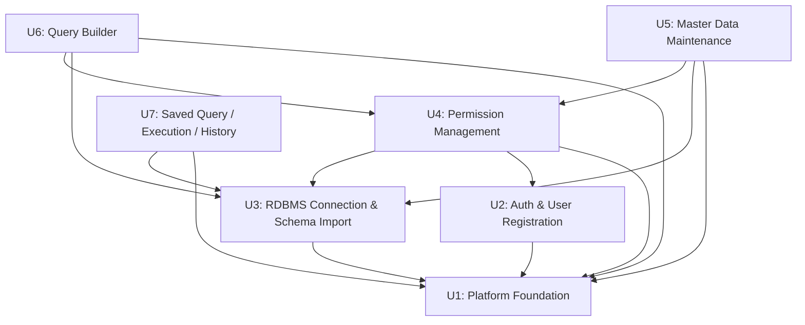

# unit-of-work-dependency.md — ユニット依存関係マトリクス

## ユニット⇔パッケージ対応

| ユニット | 所属パッケージ |
|---|---|
| U1: Platform Foundation | common, config, audit, mail |
| U2: Auth & User Registration | auth, userregistration |
| U3: RDBMS Connection & Schema Import | rdbmsconnection, schema |
| U4: Permission Management | permission |
| U5: Master Data Maintenance | masterdata |
| U6: Query Builder | querybuilder |
| U7: Saved Query / Execution / History | savedquery, queryexecution, queryhistory |

---

## ユニット間の技術的依存マトリクス

`component-dependency.md` のパッケージ単位依存マトリクスを上記対応でユニット単位に
機械的に集約したもの（ユニット内パッケージ間の依存＝ユニット内完結、のため除外）。
`✓` は「行のユニットが列のユニットに（パッケージ経由で）依存する」ことを表す。

| 依存元 \ 依存先 | U1 | U2 | U3 | U4 | U5 | U6 | U7 |
|---|:---:|:---:|:---:|:---:|:---:|:---:|:---:|
| U1 | — | | | | | | |
| U2 | ✓ | — | | | | | |
| U3 | ✓ | | — | | | | |
| U4 | ✓ | ✓ | ✓ | — | | | |
| U5 | ✓ | | ✓ | ✓ | — | | |
| U6 | ✓ | | ✓ | ✓ | | — | |
| U7 | ✓ | | ✓ | | | | — |

**根拠（パッケージ単位）**:
- U2 ← U1: `auth`→`common,audit`／`userregistration`→`common,audit,mail`
- U3 ← U1: `rdbmsconnection`→`common,audit`／`schema`→`common,audit`（+`rdbmsconnection`はU3内）
- U4 ← U1,U2,U3: `permission`→`common,audit,userregistration,schema`
- U5 ← U1,U3,U4: `masterdata`→`common,audit,rdbmsconnection,schema,permission`
- U6 ← U1,U3,U4: `querybuilder`→`common,rdbmsconnection,schema,permission`
- U7 ← U1,U3: `savedquery`→`common`／`queryexecution`→`common,audit,rdbmsconnection`
  (+`queryhistory`,`savedquery`はU7内)／`queryhistory`→`common`

**技術的に許容される並行度（参考情報）**: 上記の最小依存だけを見ると U2 と U3 はいずれも
U1のみに依存しており技術的には並行着手可能、また U7 も U4（Permission）への直接依存を
持たない（`queryexecution` は要件上テーブル/カラム権限フィルタを課されない設計、
`component-dependency.md` 注記）。ただし後述の「承認済みビルド順序」は
`unit-of-work-plan.md` Question 3（単独開発者による逐次実装、回答A）を踏まえ、
この最小依存グラフより厳格な完全逐次寄りの順序を採用している。

---

## 承認済みビルド順序（`unit-of-work-plan.md` Question 2 = A）

```
U1 → U2 → U3 → U4 → { U5, U6 } → U7
```

- U1〜U4は逐次（単独開発者を前提とし、Question 3 = Aによりチーム分割・並行開発の
  設計は行わない）
- U5とU6は技術的依存関係が同一（ともにU1・U3・U4に依存、相互依存なし）であるため
  並行着手可能（Question 2 = A）
- U7は最終段。技術的には`queryexecution`がU4に依存しないため理論上はU4完了時点でも
  着手可能だが、`savedquery`/`queryhistory`が保存・参照するSQL（クエリビルダー生成SQL等）が
  U5/U6の成果物であるというワークフロー上の関係（`unit-of-work.md` U7参照）から、
  U5・U6完了後に着手する

---

## データフロー図: ユニット依存関係の全体像



### Text Alternative（content-validation.md により常時併記）

- U1（Platform Foundation）は他のどのユニットにも依存しない最基盤ユニット。
- U2（Auth & User Registration）はU1にのみ依存する。
- U3（RDBMS Connection & Schema Import）はU1にのみ依存する。U2とU3は互いに独立しており、
  技術的な依存関係だけを見れば並行着手可能（ただし承認済みビルド順序では逐次実施）。
- U4（Permission Management）はU1・U2・U3すべてに依存する（ユーザ参照はU2、
  スキーマ整合性検証はU3経由）。
- U5（Master Data Maintenance）とU6（Query Builder）はいずれもU1・U3・U4に依存し、
  相互には依存しないため並行着手可能（承認済み）。
- U7（Saved Query / Execution / History）は技術的にはU1・U3にのみ依存し、U4
  （Permission）には依存しない設計（`queryexecution`の意図的な権限フィルタ除外）。
  承認済みビルド順序ではワークフロー上の関係からU5・U6完了後の最終段に配置する。

---

## 妥当性検証結果

- [x] 循環依存なし（U1→U2→U3→U4→{U5,U6}→U7 は有向非巡回グラフとして成立）
- [x] 各ユニットの依存先はすべて `component-dependency.md` のパッケージ単位依存
      マトリクスから機械的に導出可能であり、恣意的な追加依存は含まない
- [x] `EffectivePermissionResolver`（U4）を共有する U5・U6 は、ともにU4を経由してのみ
      権限判定を行い、直接 `permission` の内部エンティティにアクセスしない
      （`components.md` の設計方針を継承）
- [x] `queryexecution`（U7）が `permission`（U4）に依存しない設計上の例外は、
      `component-dependency.md` の注記どおり本ドキュメントにも明記済み