# Execution Plan

## Detailed Analysis Summary

### Transformation Scope (Brownfield Only)
- **Transformation Type**: 単一コンポーネント変更でも既存アーキテクチャの刷新でもない。現状は
  `backend/`（`@SpringBootApplication` のみ）・`frontend/`（Vite テンプレートのまま）という
  「スキャフォールドのみ」の状態から、`docs/PROJECT_STRUCTURE.md` に定義された全機能パッケージを
  ゼロから実装する **フルスコープの新規機能構築**。ブラウンフィールドではあるが、実質的には
  グリーンフィールドの機能開発に近い。
- **Primary Changes**: `requirements.md` 5章・`stories.md` 全33ストーリーに対応する、backend
  14機能パッケージ（`auth`, `userregistration`, `rdbmsconnection`, `schema`, `permission`,
  `masterdata`, `querybuilder`, `savedquery`, `queryexecution`, `queryhistory`, `audit`, `mail`,
  `config`, `common`）と frontend 11 feature ディレクトリの新規実装。
- **Related Components**: `devenv/`（開発用RDBMS・SMTPコンテナ、変更不要）、`docs/REQUIREMENTS.md` /
  `docs/PROJECT_STRUCTURE.md`（実装の正典として参照し続ける）。

### Change Impact Assessment
- **User-facing changes**: Yes — アプリケーション全体のUI/UXを新規構築（登録〜承認〜権限設定〜
  マスタメンテ〜クエリビルダー〜履歴まで）。
- **Structural changes**: Yes — `docs/PROJECT_STRUCTURE.md` に定義済みのパッケージ構造を
  backend/frontend 双方に新規作成する。
- **Data model changes**: Yes — 内部DB（H2/JPA）にユーザ・グループ・RDBMS接続設定・取込済み
  スキーマメタデータ・権限・保存クエリ・実行履歴・監査ログの各エンティティを新規定義。加えて
  対象RDBMS（MySQL/MariaDB/PostgreSQL/H2）を跨ぐ方言差異の抽象化が必要。
- **API changes**: Yes — REST APIをゼロから設計・実装（統一マスタ更新API、クエリビルダー/実行API
  等、`docs/REQUIREMENTS.md` の設計判断を含む）。
- **NFR impact**: Yes — JWT認証・トークン有効期限設定、パスワードハッシュ化、大量データアクセス時の
  監査ログ記録閾値、i18n対応を見据えた設計など。ただし `security-baseline` / `resiliency-baseline`
  拡張は `requirements.md` 4章の決定によりオプトアウト（後日追加予定）。

### Component Relationships (Brownfield Only)
```markdown
## Component Relationships
- **Primary Component**: backend/src/main/java/cherry/mastermeister/{feature packages}（新規）,
  frontend/src/features/{feature dirs}（新規）
- **Infrastructure Components**: devenv/docker-compose.yml（変更不要、開発時の対象RDBMS/SMTP用）
- **Shared Components**: backend の config/・common/、frontend の components/・hooks/・api/・
  store/・types/（いずれも新規作成が必要）
- **Dependent Components**: frontend の各 feature は対応する backend API に依存（API契約の
  決定順序がバックエンド側の実装順序を規定する）
- **Supporting Components**: audit/（全機能パッケージから横断的に呼び出される）、mail/（
  userregistration の確認・承認結果通知で使用）
```

For each related component:
- **backend feature packages**: Change Type = Major（新規実装）／Change Reason = Direct
  dependency（要件そのもの）／Change Priority = Critical
- **frontend feature ディレクトリ**: Change Type = Major（新規実装）／Change Reason = Direct
  dependency／Change Priority = Critical（ただしbackend API確定後に着手可能なため実装順は後追い）
- **devenv/**: Change Type = Configuration-only（初期化SQL追加程度）／Change Reason = 開発時
  対象RDBMSの受け皿／Change Priority = Optional

### Risk Assessment
- **Risk Level**: Medium — スコープはシステム全体に及ぶが、要件（`requirements.md`）とストーリー
  （`stories.md`）で仕様の大部分が具体化済み。単独開発者によるMVP段階的リリースのため、
  一度に本番投入する範囲は小さく、ロールバックは各機能パッケージ単位のgit差分で対応可能。
  未確定事項（グループ/個別権限の優先順位詳細、認証トークン設定キー名、i18nライブラリ選定）は
  Application Design / NFR Design で解消予定であり、実装前に解消される見込み。
- **Rollback Complexity**: Moderate（機能パッケージ単位で独立性が高く、Gitでのロールバックが
  基本方針）
- **Testing Complexity**: Moderate〜Complex（対象RDBMS4方言の互換性、権限合成ロジック、クエリ
  ビルダーのSQL生成/逆解析など、Property-Based Testing拡張（PBT-01〜PBT-10）の適用が有効な
  領域が多い）

## Workflow Visualization

```mermaid
flowchart TD
    Start(["User Request"])

    subgraph INCEPTION["Blue: INCEPTION PHASE"]
        WD["Workspace Detection<br/>COMPLETED"]
        RE["Reverse Engineering<br/>COMPLETED"]
        RA["Requirements Analysis<br/>COMPLETED"]
        US["User Stories<br/>COMPLETED"]
        WP["Workflow Planning<br/>IN PROGRESS"]
        AD["Application Design<br/>EXECUTE"]
        UG["Units Generation<br/>EXECUTE"]
    end

    subgraph CONSTRUCTION["Green: CONSTRUCTION PHASE per unit"]
        FD["Functional Design<br/>EXECUTE"]
        NFRR["NFR Requirements<br/>EXECUTE"]
        NFRD["NFR Design<br/>EXECUTE"]
        ID["Infrastructure Design<br/>SKIP"]
        CG["Code Generation<br/>EXECUTE"]
    end

    BT["Build and Test<br/>EXECUTE"]

    subgraph OPERATIONS["Yellow: OPERATIONS PHASE"]
        OPS["Operations<br/>PLACEHOLDER"]
    end

    Start --> WD
    WD --> RE
    RE --> RA
    RA --> US
    US --> WP
    WP --> AD
    AD --> UG
    UG --> FD
    FD --> NFRR
    NFRR --> NFRD
    NFRD --> ID
    ID --> CG
    CG --> BT
    BT --> OPS
    OPS --> End(["Complete"])

    style WD fill:#4CAF50,stroke:#1B5E20,stroke-width:3px,color:#fff
    style RE fill:#4CAF50,stroke:#1B5E20,stroke-width:3px,color:#fff
    style RA fill:#4CAF50,stroke:#1B5E20,stroke-width:3px,color:#fff
    style US fill:#4CAF50,stroke:#1B5E20,stroke-width:3px,color:#fff
    style WP fill:#FFA726,stroke:#E65100,stroke-width:3px,stroke-dasharray: 5 5,color:#000
    style AD fill:#FFA726,stroke:#E65100,stroke-width:3px,stroke-dasharray: 5 5,color:#000
    style UG fill:#FFA726,stroke:#E65100,stroke-width:3px,stroke-dasharray: 5 5,color:#000
    style FD fill:#FFA726,stroke:#E65100,stroke-width:3px,stroke-dasharray: 5 5,color:#000
    style NFRR fill:#FFA726,stroke:#E65100,stroke-width:3px,stroke-dasharray: 5 5,color:#000
    style NFRD fill:#FFA726,stroke:#E65100,stroke-width:3px,stroke-dasharray: 5 5,color:#000
    style ID fill:#BDBDBD,stroke:#424242,stroke-width:2px,stroke-dasharray: 5 5,color:#000
    style CG fill:#4CAF50,stroke:#1B5E20,stroke-width:3px,color:#fff
    style BT fill:#4CAF50,stroke:#1B5E20,stroke-width:3px,color:#fff
    style OPS fill:#BDBDBD,stroke:#424242,stroke-width:2px,stroke-dasharray: 5 5,color:#000
    style Start fill:#CE93D8,stroke:#6A1B9A,stroke-width:3px,color:#000
    style End fill:#CE93D8,stroke:#6A1B9A,stroke-width:3px,color:#000

    linkStyle default stroke:#333,stroke-width:2px
```



### Text Alternative (always included per content-validation.md)

```
Phase 1: INCEPTION
- Workspace Detection (COMPLETED)
- Reverse Engineering (COMPLETED)
- Requirements Analysis (COMPLETED)
- User Stories (COMPLETED)
- Workflow Planning (IN PROGRESS - this document)
- Application Design (EXECUTE)
- Units Generation (EXECUTE)

Phase 2: CONSTRUCTION (repeats per unit, once units are defined in Units Generation)
- Functional Design (EXECUTE)
- NFR Requirements (EXECUTE)
- NFR Design (EXECUTE)
- Infrastructure Design (SKIP)
- Code Generation (EXECUTE, always)
- Build and Test (EXECUTE, always, after all units complete)

Phase 3: OPERATIONS
- Operations (PLACEHOLDER, future expansion)
```

## Phases to Execute

### INCEPTION PHASE
- [x] Workspace Detection (COMPLETED)
- [x] Reverse Engineering (COMPLETED)
- [x] Requirements Analysis (COMPLETED)
- [x] User Stories (COMPLETED)
- [x] Workflow Planning (IN PROGRESS — this document)
- [ ] Application Design - EXECUTE
  - **Rationale**: 新規コンポーネント（backend 14パッケージ相当、frontend 11 feature）を要する。
    特にグループ/個別権限の合成ルール、JWT認証・トークン設定、対象RDBMS方言吸収層、統一
    マスタ更新API、クエリビルダーのSQL生成/逆解析アーキテクチャなど、`requirements.md` 8章の
    未解決事項を含む複数のサービス層設計判断が必要。
- [ ] Units Generation - EXECUTE
  - **Rationale**: 33ストーリー・14以上のbackend機能パッケージ・11のfrontend feature に及ぶ
    複雑なシステムであり、実装単位（Unit）への分解が必須。単一ユニットでは扱いきれない規模。

### CONSTRUCTION PHASE（ユニットごとに繰り返し実行。ユニット定義はUnits Generationで確定）
- [ ] Functional Design - EXECUTE
  - **Rationale**: ほぼ全ユニットで新規データモデル（エンティティ、DTO）や複雑な業務ロジック
    （権限合成、SQL生成/逆解析等）の詳細設計が必要。
- [ ] NFR Requirements - EXECUTE
  - **Rationale**: JWT認証・トークン有効期限、パスワードハッシュ化、大量データアクセス時の監査
    ログ記録閾値など、`requirements.md` 3章・7章に明記された非機能要件がある（auth/permission/
    masterdata/queryexecution 系ユニットで特に該当）。
- [ ] NFR Design - EXECUTE
  - **Rationale**: NFR Requirementsで洗い出された要件をユニット設計に反映するため。
- [ ] Infrastructure Design - SKIP
  - **Rationale**: 開発用インフラは `devenv/docker-compose.yml` で既に定義済みで変更不要。
    本番デプロイは実行可能WAR（12-factor、環境変数設定）という単純な形態であり、新規クラウド
    リソースやネットワーク設計は発生しないため、独立したInfrastructure Designステージは不要と
    判断。WARパッケージング設定はCode Generation内で対応する。
- [ ] Code Generation - EXECUTE (ALWAYS)
  - **Rationale**: 実装・テストコード生成が必要。
- [ ] Build and Test - EXECUTE (ALWAYS)
  - **Rationale**: 全ユニット完了後のビルド・テスト・検証が必要。

### OPERATIONS PHASE
- [ ] Operations - PLACEHOLDER
  - **Rationale**: 将来のデプロイ・監視ワークフロー拡張用のプレースホルダー。

## Package Change Sequence (Brownfield Only)

`stories.md` のPart1（MVP最小構成）の並び順、および `docs/REQUIREMENTS.md` 1章の実装優先順位
（ユーザ管理 → 対象RDBMSセットアップ → アクセス制御 → データ表示）に整合させた、backend機能
パッケージの推奨実装順序（Units Generationで正式なユニット分割を行う際の土台とする）：

1. **`config` / `common`**（横断的基盤: 共通例外・レスポンス・ページング、DataSourceConfig等）
   — 他の全パッケージが依存するため最優先。
2. **`auth` / `userregistration` / `mail`**（MVP-1〜MVP-6: 登録申請〜承認〜JWTログイン）
   — 全機能の前提となるユーザ管理フロー。
3. **`rdbmsconnection` / `schema`**（MVP-7〜MVP-8: 対象RDBMS接続登録・スキーマ取込）
   — マスタメンテ・権限設定の前提となる対象データの実体を用意する。
4. **`permission`**（MVP-9、ADM-1〜ADM-5: ユーザ/グループ単位の権限設定、YAML入出力）
   — マスタメンテ・クエリ機能がすべて依存するアクセス制御基盤。
5. **`masterdata`**（MVP-10〜MVP-11、GEN-1〜GEN-5: 一覧表示・絞込・編集・統一更新API）
6. **`querybuilder` / `savedquery` / `queryexecution` / `queryhistory`**
   （GEN-6〜GEN-16: クエリビルダー、保存、実行、履歴）
   — 権限モデル・マスタデータ表示基盤の上に構築される、最も複雑な機能群。
7. **`audit`**（ADM-6、および各機能内の監査ログ記録要件）
   — 上記各パッケージの実装と並行して横断的に組み込むが、閲覧UI（ADM-6）自体は独立した
     ユニットとして最後にまとめて実装可能。

frontend側の対応する feature ディレクトリ（`auth`, `userRegistration`, `rdbmsConnection`,
`schema`, `permission`, `masterData`, `queryBuilder`, `savedQuery`, `queryExecution`,
`queryHistory`, `auditLog`）は、対応するbackend APIの契約確定後に着手する（並行開発ではなく、
バックエンド先行のシーケンシャル/ハイブリッド方式）。

```markdown
## Module Update Strategy
- **Update Approach**: Sequential（backend機能パッケージ間は上記依存順）+ Hybrid
  （各backendパッケージのAPI確定後、対応するfrontend featureは並行着手可能）
- **Critical Path**: config/common → auth/userregistration → rdbmsconnection/schema →
  permission → masterdata → querybuilder系 → audit（閲覧UI）
- **Coordination Points**: 統一マスタ更新API（backend masterdata ⇔ frontend masterData）、
  クエリビルダーのSQL生成/逆解析ロジック（backend querybuilder ⇔ frontend queryBuilder）
- **Testing Checkpoints**: 各backendパッケージ完成時に単体テスト、対応frontend feature結合後に
  結合テスト、全ユニット完了後にBuild and Testステージでシステム全体を検証
```

## Estimated Timeline
- **Total Phases**: INCEPTION（Workflow Planning以降2ステージ）+ CONSTRUCTION（ユニット数分の
  反復 × 5ステージ + Build and Test）+ OPERATIONS（プレースホルダー）
- **Estimated Duration**: 単独開発者によるMVP段階的リリースのため単純な工数見積りは行わないが、
  Package Change Sequenceの7グループが、Units Generationステージで具体的な実装ユニット
  （およそ10〜15ユニット程度を想定）に分解される見込み。

## Success Criteria
- **Primary Goal**: `requirements.md` の機能要件（5.1〜5.8）・監査ログ要件（6章）を、
  `stories.md` の33ストーリーの受け入れ基準を満たす形ですべて実装すること。
- **Key Deliverables**: backend全機能パッケージの実装、frontend全feature実装、
  実行可能WARとしてのビルド成果物、Build and Testステージでの検証手順一式。
- **Quality Gates**: 各ユニットのCode Generation完了時の単体テスト成功、
  Property-Based Testing拡張（PBT-01〜PBT-10）の適用箇所での性質ベーステスト成功、
  Build and Testステージでの結合テスト成功。

- **Integration Testing**: backend/frontend間のAPI契約、4種の対象RDBMS方言に対する
  スキーマ取込・マスタメンテ・クエリ実行の互換性検証を含む。
- **Operational Readiness**: 現段階ではプレースホルダー（Operations フェーズ未着手）。