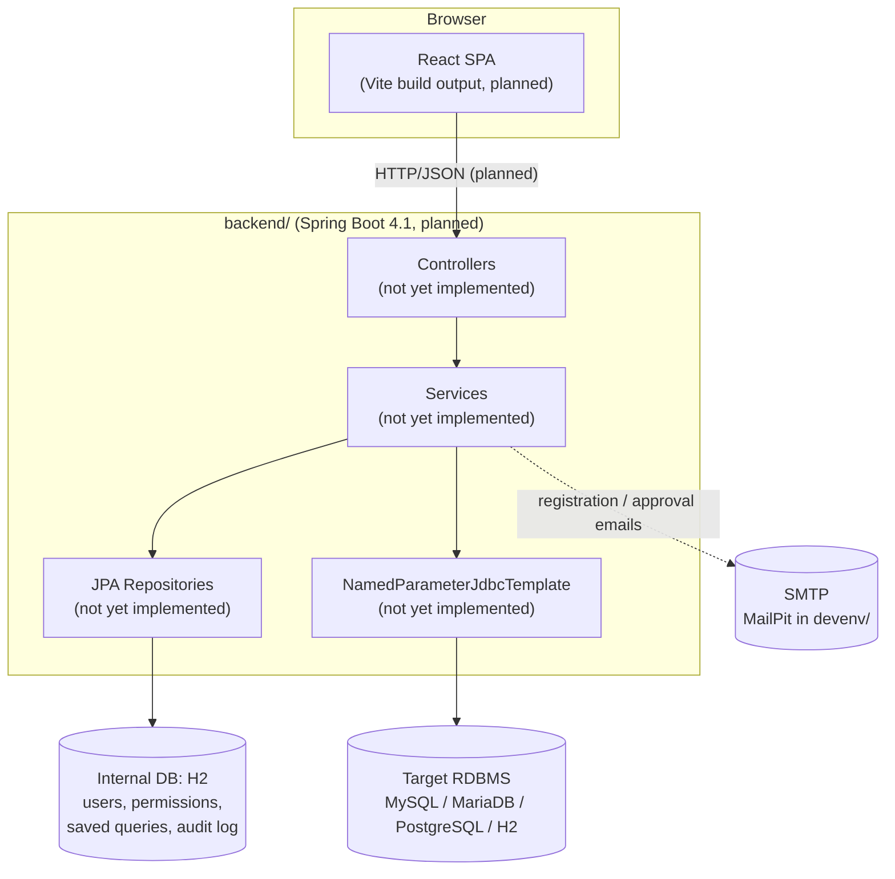
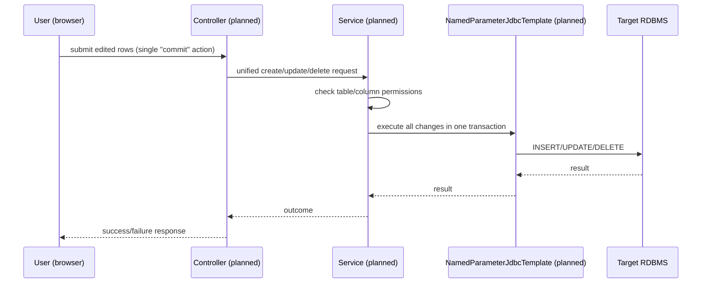

# System Architecture

## System Overview

MasterMeister is planned as a single Spring Boot backend serving a React SPA (built and embedded as static resources for an executable WAR deployment), talking to two distinct databases: an internal H2 database for its own operational data (via JPA) and one of several supported target RDBMSes for the master data being maintained (via `NamedParameterJdbcTemplate` over a connection pool). As of this analysis, only the skeleton of each piece exists — no controllers, entities, or frontend feature code have been written yet.

## Architecture Diagram

## Component Descriptions

### backend/
- **Purpose**: Server-side application; will implement every business transaction in `docs/REQUIREMENTS.md`.
- **Responsibilities**: currently none beyond booting a Spring context.
- **Dependencies**: `spring-boot-starter-web`, `spring-boot-starter-test` (test scope); Java 25 toolchain; Gradle 9.6 (Kotlin DSL) with Spring Boot BOM imported explicitly via `dependencyManagement`.
- **Type**: Application

### frontend/
- **Purpose**: SPA client; will implement the UI for every feature.
- **Responsibilities**: currently none — unmodified Vite `react-ts` template.
- **Dependencies**: React 19, ReactDOM 19, TypeScript ~6.0, Vite ^8.1, oxlint ^1.71 (lint only, no test runner configured).
- **Type**: Application (client)

### devenv/
- **Purpose**: Local dev infrastructure via Docker Compose.
- **Responsibilities**: runs MailPit (SMTP + web UI), MySQL, MariaDB, PostgreSQL containers with seeded `mastermeister` db/user/password. H2 needs no container (in-process).
- **Dependencies**: none from application code; supports manual/dev-time verification only.
- **Type**: Infrastructure (not yet runtime-verified in this environment — no Docker daemon available here)

## Data Flow

No end-to-end business workflow exists yet to diagram (no controllers or persistence code). The sequence below shows the *planned* shape for one representative transaction (master data edit) per `docs/REQUIREMENTS.md` §5.4, for forward reference only — it is not yet implemented.

## Integration Points

- **External APIs**: none yet.
- **Databases**:
  - Internal: H2 (JPA) — not yet configured (no `application.yml` datasource entries, no entities).
  - Target: MySQL / MariaDB / PostgreSQL / H2 — not yet configured; dev instances defined in `devenv/docker-compose.yml`.
- **Third-party Services**: SMTP via MailPit in dev (`devenv/docker-compose.yml`); production SMTP to be environment-configured per `docs/REQUIREMENTS.md` §7.3.

## Infrastructure Components

- **CDK Stacks**: none (not an AWS CDK project).
- **Deployment Model**: planned executable WAR (12-factor, env-var configuration) per `docs/REQUIREMENTS.md` §7.2, with Docker packaging as a secondary target; Tomcat WAR deploy as a future option. Not yet implemented.
- **Networking**: none defined yet; `devenv/docker-compose.yml` maps MailPit (1025/8025), MySQL (3306), MariaDB (3307→3306), PostgreSQL (5432) to localhost for development only.
