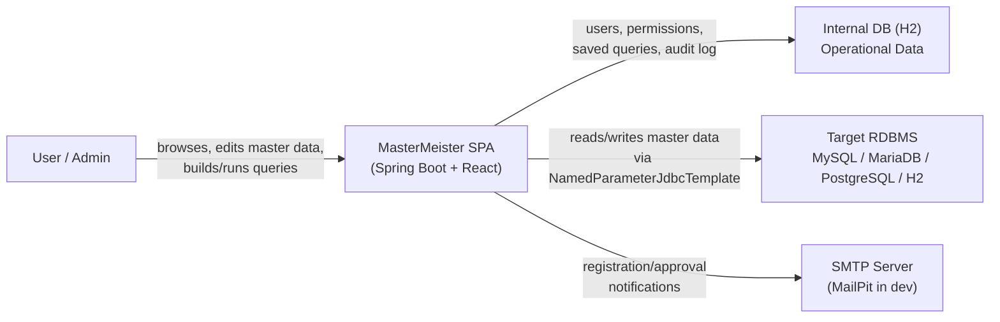

# Business Overview

## Business Context Diagram

## Business Description

- **Business Description**: MasterMeister is a web application (SPA) that lets an organization maintain master data stored in an external RDBMS. Administrators onboard users, configure a connection to the target RDBMS, import its schema, and set table/column-level permissions. End users then browse, filter, and edit master data, and can build, save, and execute SQL queries against the target RDBMS, all governed by the configured permissions and logged for audit purposes.
- **Business Transactions** (as specified in `docs/REQUIREMENTS.md`; **none are implemented in code yet** — see Implementation Status below):
  - **User Registration** (5.1): two-step, email-first self-registration with admin approval/rejection workflow and email notifications.
  - **Target RDBMS Setup** (5.2): admin configures a connection to the target RDBMS and imports its table/view/column structure into the internal DB.
  - **Permission Management** (5.2): admin sets table-level (allow/deny) and column-level (none/read/read+update/full CRUD) access permissions; import/export as YAML.
  - **User Authentication** (5.3): login required before using any feature.
  - **Master Data Maintenance** (5.4): browse tables/views, paginated record lists, permission-aware filter/sort, inline editing, unified create/update/delete transaction API.
  - **Query Builder** (5.5): tabbed UI (SELECT/FROM/JOIN/WHERE/GROUP BY/HAVING/ORDER BY/LIMIT-OFFSET) to construct SQL, plus reverse-parsing of existing SQL back into the builder.
  - **Saved Queries** (5.6): name and save SQL (public/private visibility), execute later; only the creator may edit.
  - **Query Execution** (5.7): run read-only, optionally parameterized (`:param`) SQL with pagination; records execution history.
  - **Query History** (5.8): paginated, filterable log of past query executions with navigation back into execution/save/builder flows.
- **Business Dictionary**:
  - **Internal DB**: the application's own operational database (H2, accessed via JPA) — stores users, connection configs, imported schema metadata, permissions, saved queries, execution history, audit logs.
  - **Target RDBMS**: the external database holding the actual master data being maintained (MySQL, MariaDB, PostgreSQL, or H2), accessed only via `NamedParameterJdbcTemplate` over a connection pool — never JPA.
  - **Table/Column Permission**: the access-control unit; table-level is allow/deny, column-level is none/read/read-update/full CRUD.

## Implementation Status (as of this analysis)

The repository is a **scaffold only** — no business transaction above has been implemented:
- `backend/`: a single `@SpringBootApplication` class and one context-load test; no controllers, services, entities, or repositories exist.
- `frontend/`: the unmodified Vite `react-ts` template; no feature code, routing, or API client exists.
- `devenv/`: Docker Compose definitions for supporting dev services (MailPit, MySQL, MariaDB, PostgreSQL) exist but have not been runtime-verified in this environment.

## Component Level Business Descriptions

### backend/
- **Purpose**: Will host all server-side business logic (the transactions listed above) once implemented.
- **Responsibilities (planned)**: authentication, user registration/approval, RDBMS connection management, schema import, permission enforcement, master data CRUD, query building/execution/history, audit logging, email notifications.
- **Current State**: bootstrap only (`MasterMeisterApplication` + context-load test).

### frontend/
- **Purpose**: Will provide the SPA UI mirroring each backend feature.
- **Current State**: unmodified Vite React+TypeScript template (counter demo page).

### devenv/
- **Purpose**: Provides local supporting infrastructure (mail catcher + three target-RDBMS flavors) for development against real dialects.
- **Current State**: Docker Compose file defined; not yet runtime-verified in this environment.
