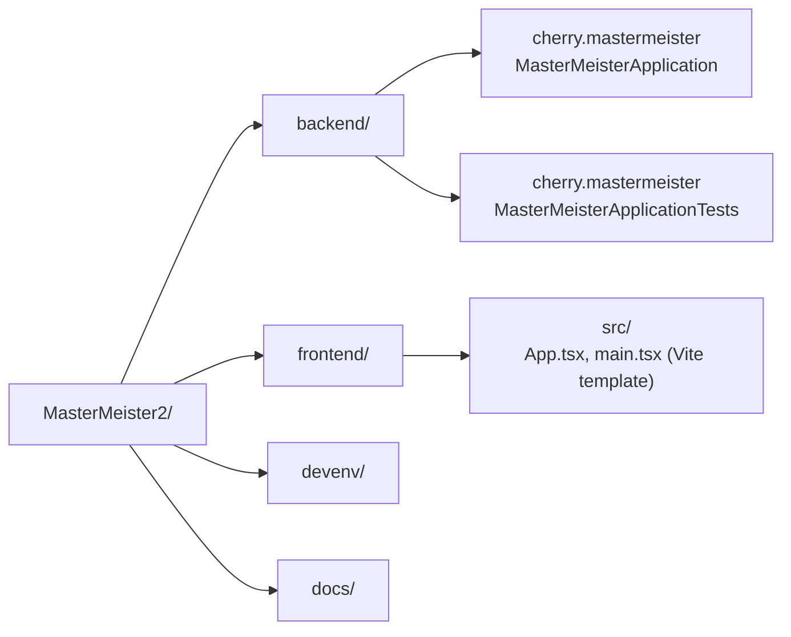

# Code Structure

## Build System

- **Backend**: Gradle 9.6.1, Kotlin DSL (`build.gradle.kts`, `settings.gradle.kts`), Gradle Wrapper committed (`backend/gradlew`, `backend/gradlew.bat`, `backend/gradle/wrapper/`). Plugins: `java`, `org.springframework.boot` 4.1.0, `io.spring.dependency-management` 1.1.7. Explicit `dependencyManagement { imports { mavenBom(...) } }` block (deliberately not relying on implicit BOM resolution). Java toolchain pinned to language version 25. `JavaCompile` tasks configured for UTF-8 source encoding. `Test` tasks use JUnit Platform.
- **Frontend**: npm, Vite ^8.1.1 (`vite.config.ts`), TypeScript ~6.0.2 (`tsc -b` project references: `tsconfig.json` → `tsconfig.app.json` + `tsconfig.node.json`). No test runner configured. oxlint ^1.71.0 for linting (`frontend/.oxlintrc.json`).
- **Devenv**: Docker Compose (`devenv/docker-compose.yml`), no build step — pulls published images (`axllent/mailpit:latest`, `mysql:lts`, `mariadb:lts`, `postgres:18`).

## Key Modules

No feature packages exist yet under `cherry.mastermeister` (auth, userregistration, rdbmsconnection, schema, permission, masterdata, querybuilder, savedquery, queryexecution, queryhistory, audit, mail) — these are documented as *planned* in `docs/PROJECT_STRUCTURE.md` only.

### Existing Files Inventory

**backend/**
- `backend/build.gradle.kts` — Gradle build script (plugins, Java toolchain, dependency management, dependencies, compile/test task config). Apache 2.0 header.
- `backend/settings.gradle.kts` — root project name (`mastermeister`). Apache 2.0 header.
- `backend/.gitignore` — Java/Gradle ignore rules (moved from repo root via `git mv`, Gradle entries appended).
- `backend/gradlew`, `backend/gradlew.bat`, `backend/gradle/wrapper/*` — Gradle Wrapper 9.6.1.
- `backend/src/main/java/cherry/mastermeister/MasterMeisterApplication.java` — the only application class; `@SpringBootApplication` entry point, no custom beans/config.
- `backend/src/main/resources/application.yml` — sets `spring.application.name: mastermeister` only.
- `backend/src/test/java/cherry/mastermeister/MasterMeisterApplicationTests.java` — single `@SpringBootTest` context-load test, no assertions beyond context startup.

**frontend/**
- `frontend/package.json` — Vite/React/TypeScript scaffold scripts and dependencies (see technology-stack.md).
- `frontend/vite.config.ts`, `frontend/tsconfig*.json` — Vite/TS project config (template defaults).
- `frontend/.oxlintrc.json` — oxlint config (template default).
- `frontend/index.html`, `frontend/src/main.tsx`, `frontend/src/App.tsx`, `frontend/src/App.css`, `frontend/src/index.css` — unmodified Vite `react-ts` template (counter demo).
- `frontend/src/assets/*`, `frontend/public/*` — template placeholder assets (React/Vite logos, hero image, favicon).
- `frontend/.gitignore` — Vite-generated ignore rules.

**devenv/**
- `devenv/docker-compose.yml` — MailPit + MySQL + MariaDB + PostgreSQL service definitions, named volumes for the three DBs, per-DB init-script mount points (`./{mysql,mariadb,postgres}/init` → `/docker-entrypoint-initdb.d`, currently empty/untracked directories).

**docs/**
- `docs/REQUIREMENTS.md` — full Japanese requirements spec (authoritative business/functional/non-functional requirements).
- `docs/PROJECT_STRUCTURE.md` — agreed backend/frontend/devenv directory and package layout (authoritative structural plan, not all of it built yet).

**Root**
- `CLAUDE.md` — guidance for AI coding assistants working in this repo (project status, commands, stack, conventions, architecture notes).
- `LICENSE` — Apache License 2.0.
- `.idea/*`, `MasterMeister2.iml` — IntelliJ project config (workspace.xml excluded via `.idea/.gitignore`).

## Design Patterns

None yet — no business logic has been written. The only structural pattern in place is the **feature-first package layout convention** (documented in `docs/PROJECT_STRUCTURE.md`, not yet populated with actual feature packages), which favors independent, per-feature `controller/service/repository/entity/dto` sub-packages over layered packaging.

## Critical Dependencies

### org.springframework.boot:spring-boot-starter-web (4.1.0, via BOM)
- **Usage**: only dependency currently pulled in beyond the BOM/test starter; no controllers use it yet.
- **Purpose**: will back the REST API layer once controllers are written.

### org.springframework.boot:spring-boot-starter-test (4.1.0, via BOM, test scope)
- **Usage**: backs the single context-load test.
- **Purpose**: JUnit 5 + Spring test support.

### react / react-dom (^19.2.7)
- **Usage**: template default render of `<App />` in `main.tsx`.
- **Purpose**: will be the SPA UI framework for all planned features.

### vite (^8.1.1), typescript (~6.0.2), oxlint (^1.71.0)
- **Usage**: dev tooling only (build, type-check, lint); no runtime app dependency.
