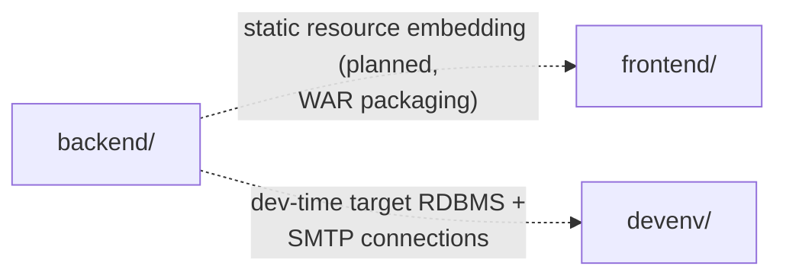

# Dependencies

## Internal Dependencies

No compile-time or runtime code dependency exists between `backend/` and `frontend/` yet (no frontend build output is embedded into the backend's `static/` resources today). The relationship shown is the *planned* WAR-packaging integration described in `docs/PROJECT_STRUCTURE.md` (`resources/static/` reserved for frontend build output) and `CLAUDE.md` (executable WAR deployment target).

`devenv/` has no code dependency on the other two; it merely provides services (`MySQL`/`MariaDB`/`PostgreSQL`/`MailPit`) that the backend is expected to connect to during local development once connection code exists.

## External Dependencies

### org.springframework.boot:spring-boot-starter-web
- **Version**: 4.1.0 (managed via Spring Boot BOM)
- **Purpose**: web/REST support for the eventual API layer
- **License**: Apache 2.0

### org.springframework.boot:spring-boot-starter-test
- **Version**: 4.1.0 (managed via Spring Boot BOM), test scope
- **Purpose**: JUnit 5 + Spring test context support
- **License**: Apache 2.0

### org.springframework.boot / io.spring.dependency-management Gradle plugins
- **Version**: 4.1.0 / 1.1.7
- **Purpose**: Spring Boot Gradle plugin (packaging, bootRun) and explicit BOM import
- **License**: Apache 2.0

### react / react-dom
- **Version**: ^19.2.7
- **Purpose**: SPA UI rendering
- **License**: MIT

### vite / @vitejs/plugin-react
- **Version**: ^8.1.1 / ^6.0.3
- **Purpose**: dev server and production build tooling
- **License**: MIT

### typescript
- **Version**: ~6.0.2
- **Purpose**: static typing, compiled via `tsc -b` before `vite build`
- **License**: Apache 2.0

### oxlint
- **Version**: ^1.71.0
- **Purpose**: fast Rust-based linter for the frontend
- **License**: MIT

### Docker images (devenv/docker-compose.yml)
- `axllent/mailpit:latest`, `mysql:lts`, `mariadb:lts`, `postgres:18` — third-party container images for local dev services only; not application dependencies.
