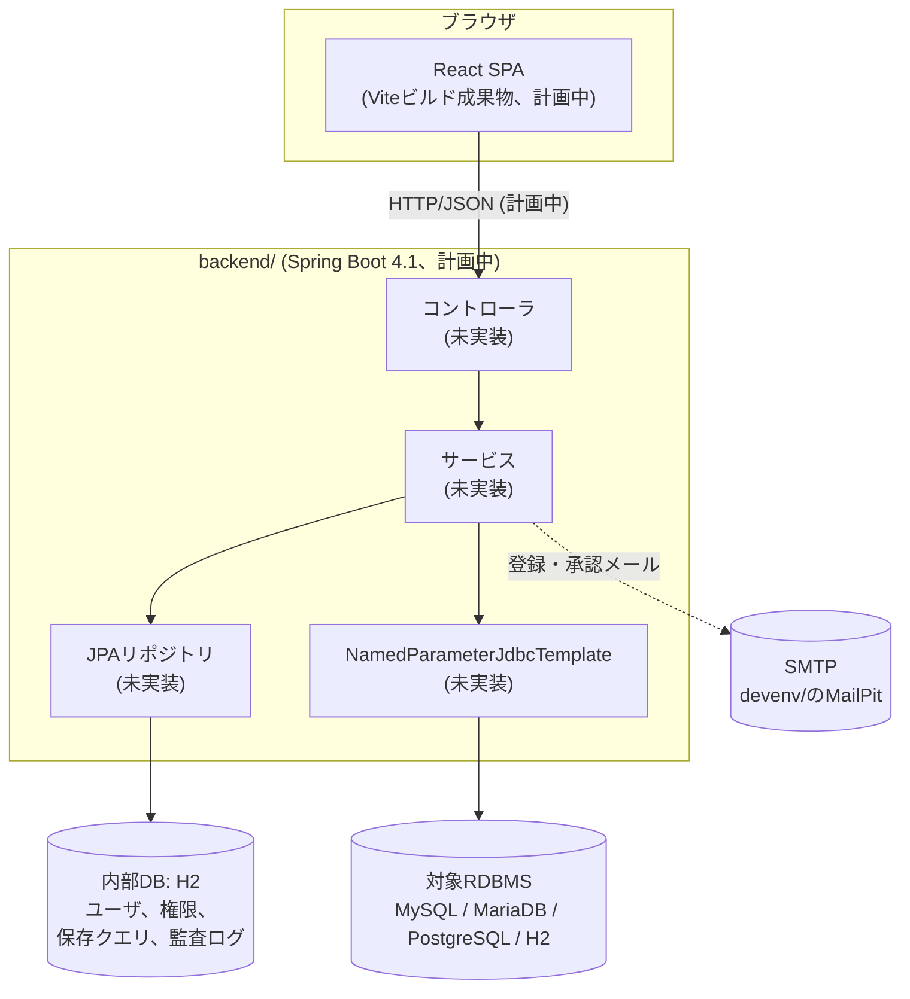
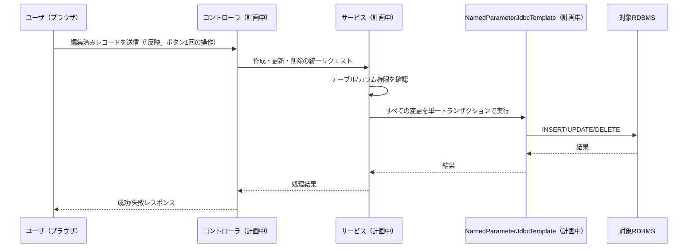

# システムアーキテクチャ

## システム概要

MasterMeisterは、単一のSpring BootバックエンドがReact SPAを配信する構成（実行可能WAR化のため、フロントエンドのビルド成果物を静的リソースとして組み込む）として計画されている。バックエンドは2種類の異なるデータベースと通信する：自身の運用データ用の内部H2データベース（JPA経由）と、メンテナンス対象のマスタデータを持つ対象RDBMS（コネクションプール上の `NamedParameterJdbcTemplate` 経由）である。本分析時点では、各要素の雛形のみが存在し、コントローラ・エンティティ・フロントエンドの機能コードは一切書かれていない。

## アーキテクチャ図

## コンポーネント説明

### backend/
- **目的**: サーバサイドアプリケーション。`docs/REQUIREMENTS.md` に定義された全業務トランザクションを実装する予定
- **責務**: 現状はSpringコンテキストの起動のみ
- **依存関係**: `spring-boot-starter-web`、`spring-boot-starter-test`（テストスコープ）、Java 25 ツールチェーン、Gradle 9.6（Kotlin DSL）で明示的な `dependencyManagement` によるSpring Boot BOMインポート
- **種別**: アプリケーション

### frontend/
- **目的**: SPAクライアント。全機能のUIを実装する予定
- **責務**: 現状はなし — 未改変のVite `react-ts` テンプレート
- **依存関係**: React 19、ReactDOM 19、TypeScript ~6.0、Vite ^8.1、oxlint ^1.71（リントのみ、テストランナー未設定）
- **種別**: アプリケーション（クライアント）

### devenv/
- **目的**: Docker Composeによるローカル開発インフラ
- **責務**: MailPit（SMTP＋WebUI）、MySQL、MariaDB、PostgreSQLコンテナを、`mastermeister` のdb/ユーザ/パスワードでシードして起動する。H2は組み込みのためコンテナ不要
- **依存関係**: アプリケーションコードからの依存はなし。手動／開発時の動作確認のみをサポート
- **種別**: インフラストラクチャ（この環境ではDockerデーモンが利用できず、動作未検証）

## データフロー

コントローラや永続化コードが存在しないため、実装済みの業務フローは図示できない。以下は、`docs/REQUIREMENTS.md` §5.4（マスタデータ編集）を例にした**計画中**のシーケンスであり、参考情報として提示するのみで、未実装である。

## 連携ポイント

- **外部API**: 現状なし
- **データベース**:
  - 内部: H2（JPA）— 未設定（`application.yml` にデータソース設定なし、エンティティなし）
  - 対象: MySQL / MariaDB / PostgreSQL / H2 — 未設定。開発用インスタンスは `devenv/docker-compose.yml` に定義済み
- **サードパーティサービス**: 開発時はMailPit経由のSMTP（`devenv/docker-compose.yml`）。本番環境のSMTPは `docs/REQUIREMENTS.md` §7.3 のとおり環境変数で設定予定

## インフラストラクチャ構成

- **CDKスタック**: なし（AWS CDKプロジェクトではない）
- **デプロイモデル**: `docs/REQUIREMENTS.md` §7.2 に従い、実行可能WAR（Twelve-Factor、環境変数設定）を計画。Dockerパッケージ化を副次的手段とし、将来的にTomcatへのWARデプロイにも対応予定。いずれも未実装
- **ネットワーキング**: 未定義。`devenv/docker-compose.yml` は開発用にMailPit（1025/8025）、MySQL（3306）、MariaDB（3307→3306）、PostgreSQL（5432）をlocalhostにマッピングしている