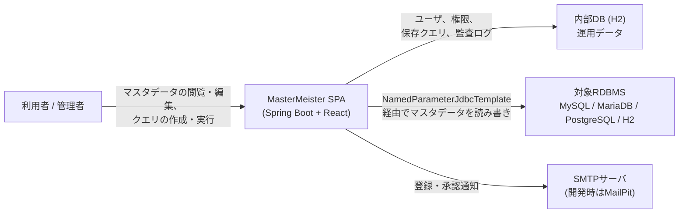

# ビジネス概要

## ビジネスコンテキスト図

## ビジネス説明

- **ビジネス概要**: MasterMeisterは、外部RDBMSに格納されたマスタデータを組織がメンテナンスするためのWebアプリケーション（SPA）である。管理者はユーザ登録を承認し、対象RDBMSへの接続を設定してそのスキーマを取り込み、テーブル/カラム単位のアクセス権限を設定する。一般ユーザはその権限の範囲内でマスタデータを閲覧・絞込・編集し、対象RDBMSに対するSQLクエリを作成・保存・実行できる。すべての操作は監査ログとして記録される。
- **ビジネストランザクション**（`docs/REQUIREMENTS.md` で定義されているもの。**いずれもコードとしては未実装** — 詳細は下記「実装状況」参照）:
  - **ユーザ登録**（5.1）: メールアドレス先行方式の2段階セルフ登録＋管理者承認/却下ワークフロー＋メール通知
  - **対象RDBMSセットアップ**（5.2）: 管理者が対象RDBMSへの接続を設定し、テーブル/ビュー/カラム構造を内部DBに取り込む
  - **権限管理**（5.2）: 管理者がテーブルレベル（許可/拒否）およびカラムレベル（アクセス不可/読み取りのみ/読み取り+更新/フルCRUD）のアクセス権限を設定。YAML形式でのインポート/エクスポートに対応
  - **ユーザ認証**（5.3）: いずれの機能を利用する前にもログインが必要
  - **マスタメンテナンス**（5.4）: テーブル/ビューの閲覧、ページング付きレコード一覧、権限に応じたフィルタ/ソート、インライン編集、作成・更新・削除を1つのトランザクションにまとめた統一API
  - **クエリビルダー**（5.5）: SELECT/FROM/JOIN/WHERE/GROUP BY/HAVING/ORDER BY/LIMIT OFFSETのタブ形式UIでSQLを組み立て、既存SQLをビルダーへ逆解析して反映することも可能
  - **クエリ保存**（5.6）: SQLに名前を付けて保存（公開/非公開）、後から実行可能。編集は作成者のみ
  - **クエリ実行**（5.7）: 読み取り専用・パラメータ化（`:param`）SQLをページング付きで実行し、実行履歴を記録
  - **クエリ履歴**（5.8）: 過去のクエリ実行をページング・絞込付きで一覧表示し、実行/保存/ビルダー画面へ遷移可能
- **ビジネス用語辞書**:
  - **内部DB**: アプリケーション自身の運用データベース（H2、JPA経由でアクセス）。ユーザ、接続設定、取り込んだスキーマメタデータ、権限、保存クエリ、実行履歴、監査ログを格納する
  - **対象RDBMS**: メンテナンス対象の実際のマスタデータを保持する外部データベース（MySQL、MariaDB、PostgreSQL、H2のいずれか）。JPAは使わず、コネクションプール上の `NamedParameterJdbcTemplate` のみでアクセスする
  - **テーブル/カラム権限**: アクセス制御の単位。テーブルレベルは許可/拒否、カラムレベルはアクセス不可/読み取りのみ/読み取り+更新/フルCRUDの4段階

## 実装状況（本分析時点）

このリポジトリは**雛形のみ**であり、上記のビジネストランザクションは1つも実装されていない：
- `backend/`: `@SpringBootApplication` クラス1つとコンテキストロードテスト1つのみ。コントローラ、サービス、エンティティ、リポジトリは一切存在しない
- `frontend/`: 未改変のVite `react-ts` テンプレート。機能コード、ルーティング、APIクライアントは存在しない
- `devenv/`: 開発用サポートサービス（MailPit、MySQL、MariaDB、PostgreSQL）のDocker Compose定義は存在するが、この環境では動作確認未実施

## コンポーネント単位のビジネス説明

### backend/
- **目的**: 上記に列挙したすべての業務トランザクションのサーバサイドロジックを実装する予定
- **責務（計画）**: 認証、ユーザ登録/承認、RDBMS接続管理、スキーマ取り込み、権限適用、マスタデータCRUD、クエリの構築/実行/履歴、監査ログ、メール通知
- **現状**: 起動用の雛形のみ（`MasterMeisterApplication` + コンテキストロードテスト）

### frontend/
- **目的**: バックエンドの各機能に対応するSPA UIを提供する予定
- **現状**: 未改変のVite React+TypeScriptテンプレート（カウンターのデモ画面）

### devenv/
- **目的**: 実際のRDBMS方言に対して開発できるよう、ローカルのサポートインフラ（メールキャッチャー＋対象RDBMS3種）を提供する
- **現状**: Docker Compose定義は作成済みだが、この環境では動作確認未実施