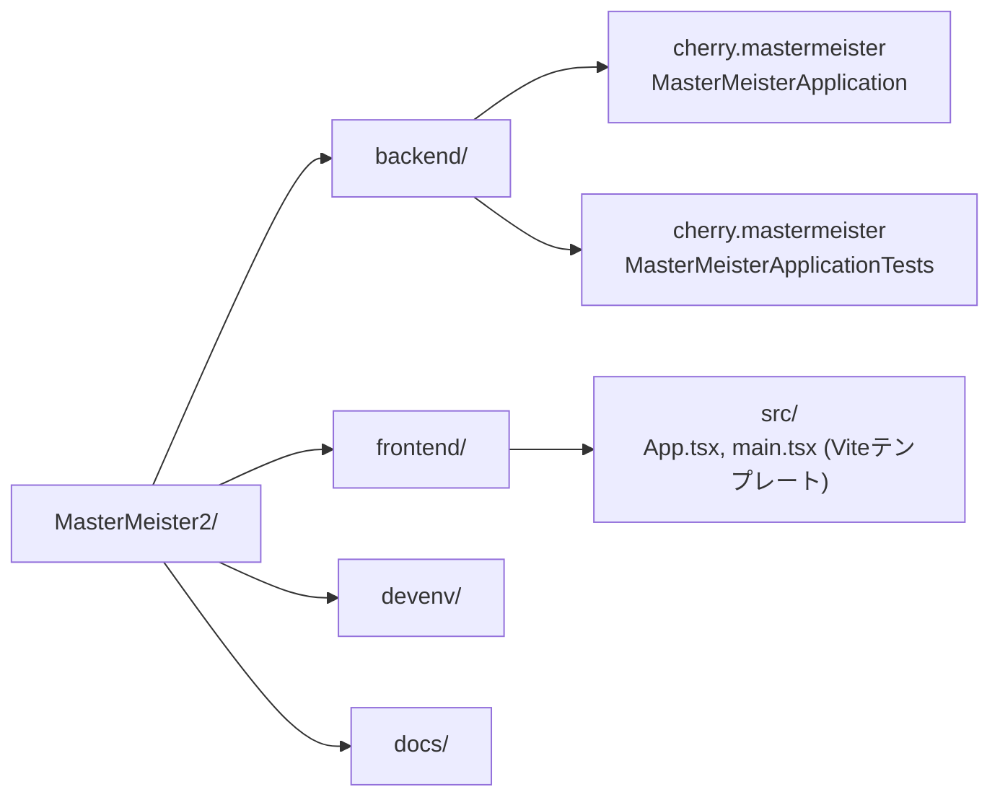

# コード構造

## ビルドシステム

- **バックエンド**: Gradle 9.6.1、Kotlin DSL（`build.gradle.kts`、`settings.gradle.kts`）、Gradle Wrapperをコミット済み（`backend/gradlew`、`backend/gradlew.bat`、`backend/gradle/wrapper/`）。プラグイン: `java`、`org.springframework.boot` 4.1.0、`io.spring.dependency-management` 1.1.7。暗黙のBOM解決に頼らず、明示的な `dependencyManagement { imports { mavenBom(...) } }` ブロックを使用。Javaツールチェーンは言語バージョン25に固定。`JavaCompile` タスクはUTF-8ソースエンコーディングを設定。`Test` タスクはJUnit Platformを使用。
- **フロントエンド**: npm、Vite ^8.1.1（`vite.config.ts`）、TypeScript ~6.0.2（`tsc -b` プロジェクト参照: `tsconfig.json` → `tsconfig.app.json` + `tsconfig.node.json`）。テストランナーは未設定。リントには oxlint ^1.71.0 を使用（`frontend/.oxlintrc.json`）。
- **devenv**: Docker Compose（`devenv/docker-compose.yml`）。ビルドステップはなく、公開済みイメージ（`axllent/mailpit:latest`、`mysql:lts`、`mariadb:lts`、`postgres:18`）をpullするのみ。

## 主要モジュール

`cherry.mastermeister` 配下には機能パッケージ（auth、userregistration、rdbmsconnection、schema、permission、masterdata、querybuilder、savedquery、queryexecution、queryhistory、audit、mail）はまだ存在しない。これらは `docs/PROJECT_STRUCTURE.md` に**計画**として記載されているのみ。

### 既存ファイル一覧

**backend/**
- `backend/build.gradle.kts` — Gradleビルドスクリプト（プラグイン、Javaツールチェーン、依存管理、依存関係、コンパイル/テストタスク設定）。Apache 2.0ヘッダー付き
- `backend/settings.gradle.kts` — ルートプロジェクト名（`mastermeister`）。Apache 2.0ヘッダー付き
- `backend/.gitignore` — Java/Gradle用ignoreルール（`git mv` でルートから移動、Gradle関連エントリを追記）
- `backend/gradlew`、`backend/gradlew.bat`、`backend/gradle/wrapper/*` — Gradle Wrapper 9.6.1
- `backend/src/main/java/cherry/mastermeister/MasterMeisterApplication.java` — 唯一のアプリケーションクラス。`@SpringBootApplication` のエントリポイントで、独自のBean/設定なし
- `backend/src/main/resources/application.yml` — `spring.application.name: mastermeister` のみ設定
- `backend/src/test/java/cherry/mastermeister/MasterMeisterApplicationTests.java` — `@SpringBootTest` によるコンテキストロードテスト1つのみ。起動確認以外のアサーションなし

**frontend/**
- `frontend/package.json` — Vite/React/TypeScriptの雛形スクリプトと依存関係（technology-stack.md参照）
- `frontend/vite.config.ts`、`frontend/tsconfig*.json` — Vite/TSプロジェクト設定（テンプレートのデフォルト）
- `frontend/.oxlintrc.json` — oxlint設定（テンプレートのデフォルト）
- `frontend/index.html`、`frontend/src/main.tsx`、`frontend/src/App.tsx`、`frontend/src/App.css`、`frontend/src/index.css` — 未改変のViteの `react-ts` テンプレート（カウンターのデモ）
- `frontend/src/assets/*`、`frontend/public/*` — テンプレートのプレースホルダー資産（React/Viteロゴ、hero画像、favicon）
- `frontend/.gitignore` — Vite生成のignoreルール

**devenv/**
- `devenv/docker-compose.yml` — MailPit + MySQL + MariaDB + PostgreSQLのサービス定義、3種のDB用名前付きボリューム、DBごとの初期化スクリプトのマウントポイント（`./{mysql,mariadb,postgres}/init` → `/docker-entrypoint-initdb.d`、現状は空の未追跡ディレクトリ）

**docs/**
- `docs/REQUIREMENTS.md` — 要件定義書（業務・機能・非機能要件の一次情報源）
- `docs/PROJECT_STRUCTURE.md` — backend/frontend/devenvのディレクトリ・パッケージ構成案（構造上の一次情報源。一部は未構築）

**ルート**
- `CLAUDE.md` — AIコーディングアシスタント向けの本リポジトリ作業ガイド（プロジェクト状況、コマンド、スタック、規約、アーキテクチャメモ）
- `LICENSE` — Apache License 2.0
- `.idea/*`、`MasterMeister2.iml` — IntelliJプロジェクト設定（`workspace.xml` は `.idea/.gitignore` により除外）

## デザインパターン

業務ロジックが未実装のため、現状パターンはなし。唯一存在する構造上の方針は、**機能優先（feature-first）パッケージ構成**の規約（`docs/PROJECT_STRUCTURE.md` に記載、実際の機能パッケージはまだ未投入）で、レイヤー別構成よりも機能ごとの独立した `controller/service/repository/entity/dto` サブパッケージを優先する。

## 重要な依存関係

### org.springframework.boot:spring-boot-starter-web（4.1.0、BOM経由）
- **使用状況**: BOM/テストスターター以外で唯一取り込まれている依存関係。コントローラが未実装のため未使用
- **目的**: 将来的なREST APIレイヤーを支える

### org.springframework.boot:spring-boot-starter-test（4.1.0、BOM経由、テストスコープ）
- **使用状況**: コンテキストロードテスト1つのみを支える
- **目的**: JUnit 5 + Springテストサポート

### react / react-dom（^19.2.7）
- **使用状況**: `main.tsx` での `<App />` テンプレートデフォルトレンダリング
- **目的**: 計画中の全機能のSPA UIフレームワークとなる予定

### vite（^8.1.1）、typescript（~6.0.2）、oxlint（^1.71.0）
- **使用状況**: 開発ツールのみ（ビルド、型チェック、リント）。実行時のアプリ依存ではない