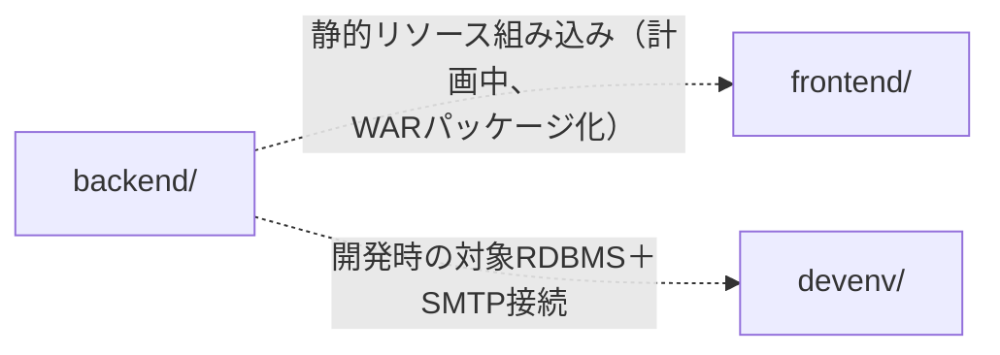

# 依存関係

## 内部依存関係

`backend/` と `frontend/` の間には、コンパイル時・実行時いずれのコード依存もまだ存在しない（フロントエンドのビルド成果物がバックエンドの `static/` リソースに組み込まれる仕組みは現状ない）。図に示す関係は、`docs/PROJECT_STRUCTURE.md`（`resources/static/` をフロントエンドビルド成果物用に予約）および `CLAUDE.md`（実行可能WARデプロイを目標とする）に記載された**計画中**のWARパッケージ化統合を表す。

`devenv/` は他の2つに対するコード依存を持たない。単に、接続コードが実装された後にバックエンドが接続する予定のサービス（`MySQL`/`MariaDB`/`PostgreSQL`/`MailPit`）を提供するのみ。

## 外部依存関係

### org.springframework.boot:spring-boot-starter-web
- **バージョン**: 4.1.0（Spring Boot BOM管理）
- **目的**: 将来的なAPIレイヤーのためのWeb/REST対応
- **ライセンス**: Apache 2.0

### org.springframework.boot:spring-boot-starter-test
- **バージョン**: 4.1.0（Spring Boot BOM管理）、テストスコープ
- **目的**: JUnit 5 + Springテストコンテキストサポート
- **ライセンス**: Apache 2.0

### org.springframework.boot / io.spring.dependency-management Gradleプラグイン
- **バージョン**: 4.1.0 / 1.1.7
- **目的**: Spring Boot Gradleプラグイン（パッケージング、bootRun）と明示的BOMインポート
- **ライセンス**: Apache 2.0

### react / react-dom
- **バージョン**: ^19.2.7
- **目的**: SPA UIレンダリング
- **ライセンス**: MIT

### vite / @vitejs/plugin-react
- **バージョン**: ^8.1.1 / ^6.0.3
- **目的**: 開発サーバとプロダクションビルドツール
- **ライセンス**: MIT

### typescript
- **バージョン**: ~6.0.2
- **目的**: 静的型付け。`vite build` の前に `tsc -b` でコンパイル
- **ライセンス**: Apache 2.0

### oxlint
- **バージョン**: ^1.71.0
- **目的**: フロントエンド用の高速Rust製リンタ
- **ライセンス**: MIT

### Dockerイメージ（devenv/docker-compose.yml）
- `axllent/mailpit:latest`、`mysql:lts`、`mariadb:lts`、`postgres:18` — ローカル開発サービス専用のサードパーティコンテナイメージ。アプリケーションの依存関係ではない